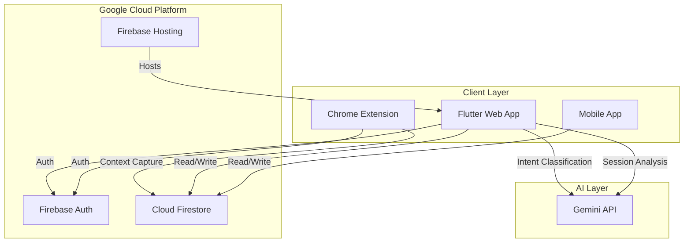

# RESET AI – Intelligent Context Recovery Platform

> 🧠 Never lose your thought flow again. RESET AI uses AI-powered intelligence to detect context loss and restore your cognitive state instantly.


---

## 🎯 The Problem

**Digital overload is real.** Knowledge workers switch between 10+ apps daily, losing precious minutes rebuilding mental context after each interruption. This "context loss" creates:

- 🕐 **23 minutes** average time to refocus after interruptions
- 🧠 **Cognitive fatigue** from constant mental rebuilding
- 📉 **40% productivity loss** in fragmented work environments

---

## 💡 The Solution

**RESET AI** is an AI-powered Context Recovery Platform that:

1. **Captures** your browsing context automatically via Chrome Extension
2. **Classifies** activities by intent (Work, Learning, Research, Distraction)
3. **Analyzes** patterns to provide actionable productivity insights
4. **Recovers** your thought flow with one-tap context restoration

---

## 🏗️ Architecture



---

## 🧠 AI-First Features

### 1. Intent Classification Engine
Every browsing activity is classified by purpose:
- **Work**: GitHub, Jira, Figma, Notion
- **Learning**: Coursera, Stack Overflow, tutorials
- **Research**: Documentation, API references
- **Distraction**: Social media, news sites

> **Explainable AI**: Each classification includes reasoning so users understand why activities were categorized.

### 2. AI Session Summaries
Gemini generates intelligent session summaries highlighting:
- What you were trying to accomplish
- What distracted you
- Key pages visited
- Suggested next actions

### 3. Productivity Insights
- **Focus Score**: Real-time productivity tracking
- **Distraction Patterns**: Identify recurring productivity blockers
- **Weekly Trends**: Track improvement over time
- **Smart Recommendations**: Context-aware focus suggestions

### 4. One-Tap Context Recovery
Resume exactly where you left off with:
- Full context restoration
- Scroll position memory
- Key points summary
- Suggested next steps

---

## 🔐 Privacy & Responsible AI

RESET AI follows Google's [Responsible AI Practices](https://ai.google/responsibility/principles/):

| Principle | Implementation |
|-----------|----------------|
| **Privacy-First** | All data is user-scoped, never shared or sold |
| **Transparency** | AI decisions include explainable reasoning |
| **User Control** | Data export and permanent deletion available |
| **Security** | Firebase Security Rules enforce data isolation |
| **Consent** | Extension requires explicit user activation |

---

## 🌐 Google Ecosystem Integration

| Technology | Purpose |
|------------|---------|
| **Firebase Authentication** | Email/Password + Google Sign-In |
| **Cloud Firestore** | Real-time data sync with security rules |
| **Firebase Hosting** | Global CDN for web app |
| **Gemini API** | Intent classification, summaries, recommendations |
| **Chrome Extension** | Context capture integration |
| **Material Design 3** | Modern, accessible UI components |
| **Google Fonts** | Premium typography (Inter, Roboto) |

---

## 📂 Project Structure

```
Reset AI/
├── flutter_app/              # Flutter Web + Mobile App
│   ├── lib/
│   │   ├── main.dart
│   │   ├── screens/          # UI screens (12 pages)
│   │   ├── widgets/          # Reusable components
│   │   ├── services/         # Business logic + AI
│   │   │   ├── auth_service.dart
│   │   │   ├── context_service.dart
│   │   │   ├── gemini_service.dart    # AI Intelligence
│   │   │   └── demo_data_service.dart
│   │   ├── models/           # Data models
│   │   └── router/           # Navigation (GoRouter)
│   └── pubspec.yaml
│
├── chrome_extension/         # Chrome Extension
│   ├── manifest.json
│   ├── src/
│   │   ├── popup.js          # Extension UI
│   │   ├── firebase.js       # Auth integration
│   │   └── background.js     # Tab tracking
│   └── content.js            # Page capture
│
├── firestore.rules           # Security rules
├── firebase.json             # Hosting config
└── README.md
```

---

## 🚀 Quick Start

### Prerequisites
- Flutter SDK 3.0+
- Node.js 18+
- Firebase CLI
- Chrome browser

### 1. Flutter App

```bash
cd flutter_app
flutter pub get
flutter run -d chrome
```

### 2. Chrome Extension

```bash
# In Chrome:
# 1. Navigate to chrome://extensions
# 2. Enable Developer Mode
# 3. Click "Load unpacked"
# 4. Select chrome_extension folder
```

### 3. Firebase Setup

```bash
firebase login
firebase init
firebase deploy
```

---

## 🎯 Demo Flow

For hackathon judges, here's the recommended demo path:

1. **Landing Page** → See the problem/solution story
2. **Sign Up** → Google Sign-In or Email
3. **Onboarding** → Privacy commitment + Extension install
4. **Dashboard** → Neuro-Flow Score + Active Workspace
5. **Analytics** → Focus Timeline + Intent Distribution
6. **Session Detail** → AI Summary + Explainable insights
7. **Settings** → Privacy controls + Data export

---

## 📊 Impact Metrics

Target outcomes for users:

| Metric | Goal |
|--------|------|
| Time saved per interruption | 15+ minutes |
| Context recovery success rate | 90%+ |
| User focus score improvement | 20%+ weekly |
| Distraction awareness | High visibility |

---

## 🗺️ Future Roadmap

- [ ] Cross-browser extension support (Firefox, Edge)
- [ ] Desktop app with deep OS integration
- [ ] Team productivity dashboards
- [ ] Smart wearable notifications
- [ ] Advanced ML for personalized insights

---

## 👥 Team

Built for **GDG Hackathon 2026**

---

## 📄 License

MIT License - see LICENSE file for details.

---

<p align="center">
  Built with ❤️ using Google Technologies
  <br>
  <strong>Firebase • Gemini AI • Flutter • Material Design</strong>
</p>
