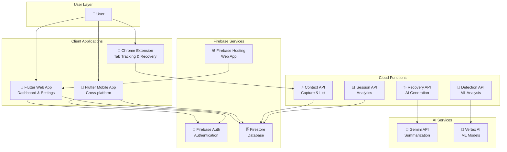
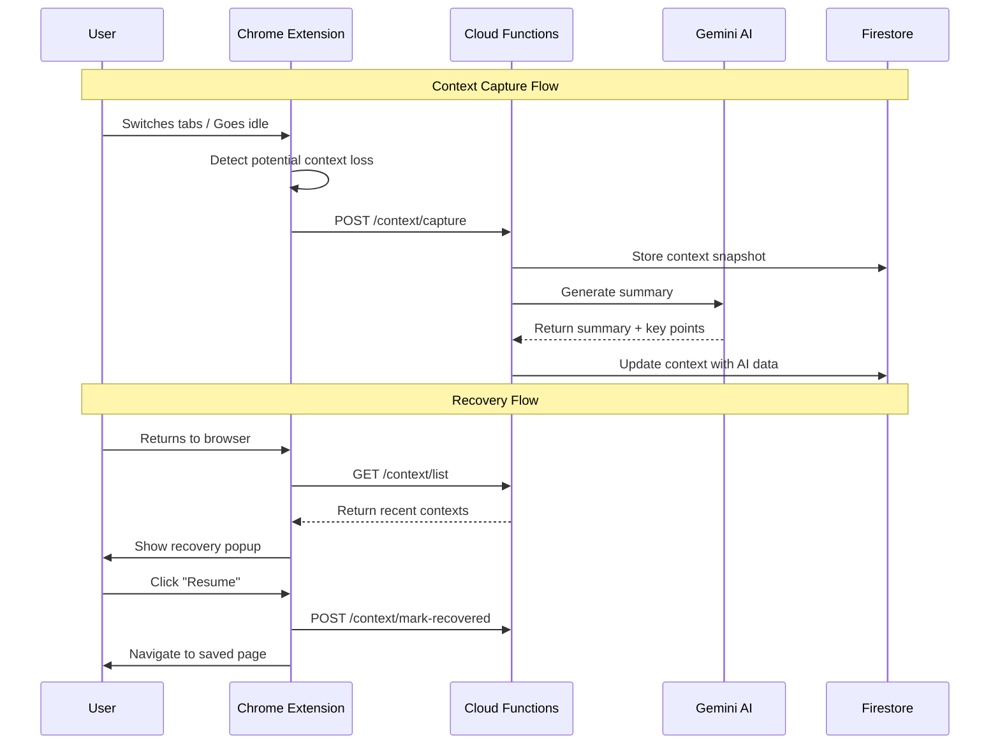
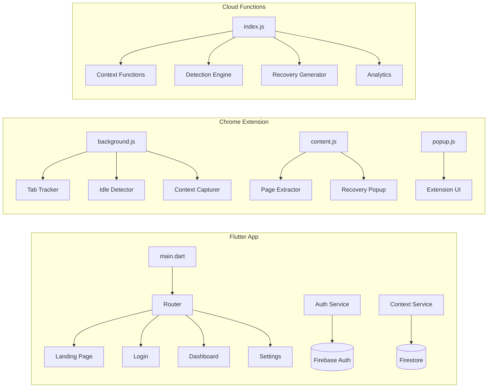
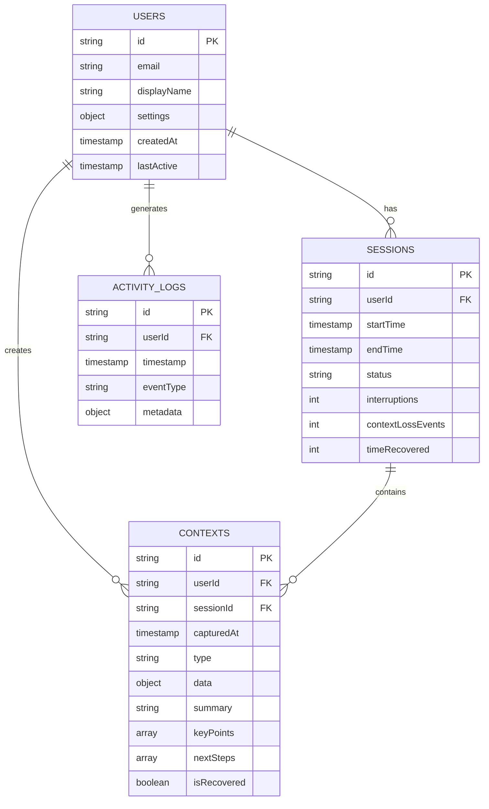

# Architecture Diagram - Mermaid Format

```mermaid
graph TB
    subgraph "User Layer"
        U[👤 User]
    end

    subgraph "Client Applications"
        CE[🧩 Chrome Extension<br/>Tab Tracking & Recovery]
        FW[📱 Flutter Web App<br/>Dashboard & Settings]
        FM[📲 Flutter Mobile App<br/>Cross-platform]
    end

    subgraph "Firebase Services"
        FA[🔐 Firebase Auth<br/>Authentication]
        FS[🗄️ Firestore<br/>Database]
        FH[🌐 Firebase Hosting<br/>Web App]
    end

    subgraph "Cloud Functions"
        CF[⚡ Context API<br/>Capture & List]
        DL[🧠 Detection API<br/>ML Analysis]
        GR[✨ Recovery API<br/>AI Generation]
        SS[📊 Session API<br/>Analytics]
    end

    subgraph "AI Services"
        GA[🤖 Gemini API<br/>Summarization]
        VA[🔮 Vertex AI<br/>ML Models]
    end

    U --> CE
    U --> FW
    U --> FM

    CE --> CF
    FW --> FA
    FW --> FS
    FM --> FA
    FM --> FS

    CF --> FS
    DL --> VA
    GR --> GA
    SS --> FS

    FH --> FW
```

## Data Flow Diagram

```mermaid
sequenceDiagram
    participant U as User
    participant CE as Chrome Extension
    participant CF as Cloud Functions
    participant AI as Gemini AI
    participant DB as Firestore

    Note over U,DB: Context Capture Flow
    U->>CE: Switches tabs / Goes idle
    CE->>CE: Detect potential context loss
    CE->>CF: POST /context/capture
    CF->>DB: Store context snapshot
    CF->>AI: Generate summary
    AI-->>CF: Return summary + key points
    CF->>DB: Update context with AI data

    Note over U,DB: Recovery Flow
    U->>CE: Returns to browser
    CE->>CF: GET /context/list
    CF-->>CE: Return recent contexts
    CE->>U: Show recovery popup
    U->>CE: Click "Resume"
    CE->>CF: POST /context/mark-recovered
    CE->>U: Navigate to saved page
```

## Component Architecture

```mermaid
flowchart LR
    subgraph Flutter App
        M[main.dart] --> R[Router]
        R --> LP[Landing Page]
        R --> LN[Login]
        R --> DB[Dashboard]
        R --> ST[Settings]
        
        AS[Auth Service] --> FA[(Firebase Auth)]
        CS[Context Service] --> FS[(Firestore)]
    end

    subgraph Chrome Extension
        BG[background.js] --> TT[Tab Tracker]
        BG --> ID[Idle Detector]
        BG --> CC[Context Capturer]
        
        CT[content.js] --> PE[Page Extractor]
        CT --> RP[Recovery Popup]
        
        PP[popup.js] --> UI[Extension UI]
    end

    subgraph Cloud Functions
        IDX[index.js] --> CTX[Context Functions]
        IDX --> DET[Detection Engine]
        IDX --> REC[Recovery Generator]
        IDX --> ANA[Analytics]
    end
```

## Database Schema

```mermaid
erDiagram
    USERS ||--o{ SESSIONS : has
    USERS ||--o{ CONTEXTS : creates
    SESSIONS ||--o{ CONTEXTS : contains
    USERS ||--o{ ACTIVITY_LOGS : generates

    USERS {
        string id PK
        string email
        string displayName
        object settings
        timestamp createdAt
        timestamp lastActive
    }

    SESSIONS {
        string id PK
        string userId FK
        timestamp startTime
        timestamp endTime
        string status
        int interruptions
        int contextLossEvents
        int timeRecovered
    }

    CONTEXTS {
        string id PK
        string userId FK
        string sessionId FK
        timestamp capturedAt
        string type
        object data
        string summary
        array keyPoints
        array nextSteps
        boolean isRecovered
    }

    ACTIVITY_LOGS {
        string id PK
        string userId FK
        timestamp timestamp
        string eventType
        object metadata
    }
```
